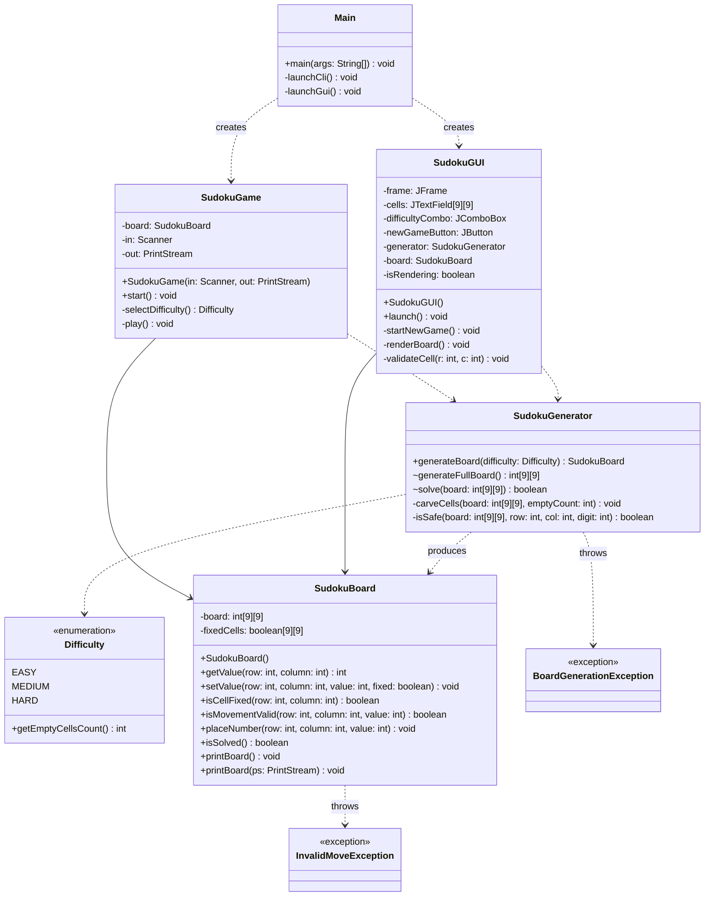
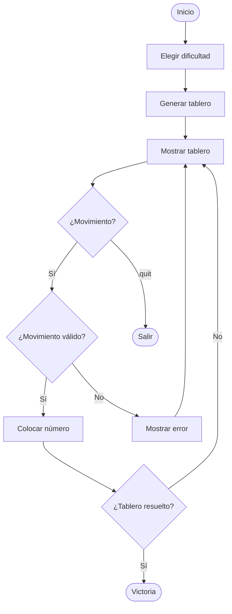
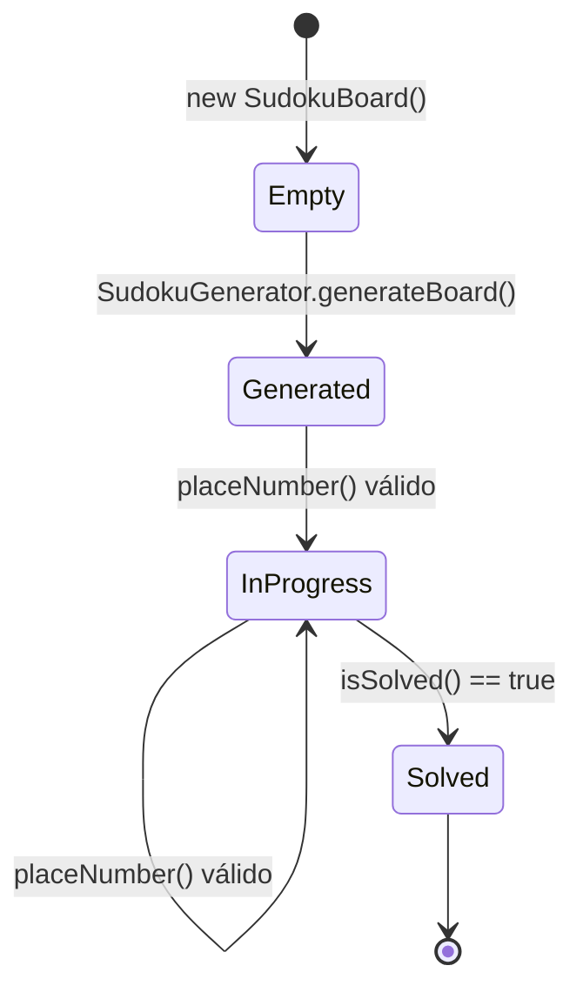

# Diagrama UML — Proyecto Sudoku

> Este documento se actualiza en el mismo commit que cualquier cambio en signatures públicas (clases, métodos públicos, enums).

## Diagrama de clases (estado objetivo)

## Diagrama de actividad (flujo de juego en CLI)

## Diagrama de estados del tablero

